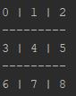

# Java-TicTacToe

### Controls

-You will be asked to choose which location you would like to place your 'X' character. 
-You will then play until you or the computer wins
  
### Getting Started

Follow these instructions to download a release version of this program and to learn how to install it.

### Prerequisites

Current versions work on all platforms.

 

You can download the Repository from [here](https://github.com/brosius02/Java-TicTacToe/releases).

## How to Install

Follow these instructions to unpackage and install releases found on our [release page](https://github.com/brosius02/Java-TicTacToe/releases).

Navigate to your download location. Typically in your downloads folder.

Now open the jar file. 

If you have a different release version, replace the "0.1" with the correct version.

Now navigate to the unpackaged files.

Again if you have a different release version, replace the "0.1" with the correct version.

And it's downloaded! Now you can break bricks whenever you please.

## Authors

* **John Brosius
# Getting Started

## License

This project is licensed under the GNU General Public License v3.0 - see the [LICENSE.md](LICENSE.md) file for details

## Acknowledgments

* John Brosius 5/22/2019
